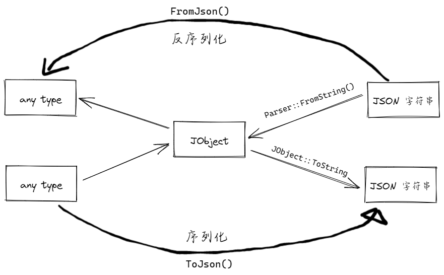

# 1. 支持vscode类型注释的Json解析器

- [x] 采用递归下降解析json
- [x] header-only的库
- [x] 写着玩，性能上不要有什么期待

# 2. 解析图示



# 3. 用法

使用时，只需要 include 一个头文件：`Parser.h`，JObject用于中间转化，对于用户来说，可以不用理会。  
但是在实际项目中，请你下载这两个文件放在你的头文件目录中：[Parser.h](./include/Parser.h)
和 [JObject.h](./include/JObject.h)

## 3.1 解析JSON文件

见[示例代码1](./src/test_Json_Parser.cpp)

## 3.2 struct到json的序列化 & json到struct的反序列化

见[示例代码2](./src/test_serialize.cpp)
## 4. 关于宏定义
由于Parser.h中定义的宏太多，这里解释一下：
```cpp
struct Base
{
    int pp;
    string qq;

    START_FROM_JSON //生成反序列化相关的方法
        pp = from("pp", int);
        qq = from("qq", string);
    END_FROM_JSON

    START_TO_JSON //生成序列化相关的代码
        to("pp") = pp;
        to("qq") = qq;
    END_TO_JSON
};
```
替换之后：
```cpp
struct Base
{
    int pp;
    string qq;

    void _from_json(json::JObject& obj){ //反序列化
        pp = obj[pp].Value<int>();
        qq = obj[qq].Value<string>();
    }
    
    void _to_json(json::JObject& obj){//序列化代码
        obj["pp"] = pp;
        obj["qq"] = qq;
    }
};
```
例如，在 `Parser::TOJSON(item)`函数中，如果item的类型是`dict`，那么就会调用 `item.FUNC_TO_NAME()`
即 `item._to_json()` 方法实现将成员变量添加到JSON对象中。
# 5. 关于JSON解析
## 5.1 JSON基本格式：
1. `null`，用std::string
2. `bool`，用bool
3. `number`(包含整数，和浮点数)，需要考虑负号，和小数点
4. `string`，用 std::string  
复合类型：
5. `list类型`，用 vector<JObject>
6. `dict类型`，用 unordered_map<JObject>  
## 5.2 JObject类
其中定义了两个变量，用来存储JObject的类型和数据
```cpp
TYPE m_type; /*TYPE是一个枚举类型，用来标识JObject里面数据的类型*/
value_t m_value;/*记录JObject里面的实际数据*/
/*value_t 是std::variant<(json类型)>，是一个内存安全的union*/
```
## 5.3 Parser类
主要负责解析JSON字符串，封装了序列化，反序列化方法。  
> 同时，增加了解析具有 `\\`开头注释的JSON文件的功能。

类中，使用两个变量，`m_str`保存当前解析的字符串。 `m_idx`初始化为0，保存的是目前解析到的字符在字符串`m_str`中的位置。
```cpp
string m_str;
size_t m_idx{}; /*当前解析的字符的位置 0 */
```
# 6. TODO:与其他开源项目的性能对比
测试用的json文件，是我从vscode里面取出来的[VScode配置文件](./test_json/vscode_Nocomment.json)。  

| 库        | 用时  |
|----------|-----|
| MyJSON   |     |
| rapidJSON |     |
| simdJSON |     | 
